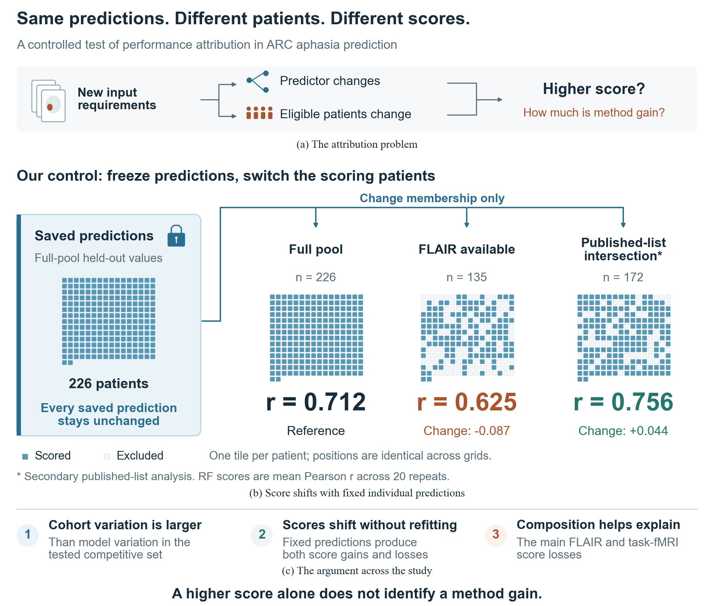

# Higher Scores, Unchanged Predictions

**Cohort Selection in Lesion-Based Aphasia Severity Prediction**

Code and numerical artifacts for the manuscript prepared for **IEEE Access**.

## The question

A new prediction method often comes with new imaging requirements. Those
requirements also change which patients can enter the evaluation. How much can
the reported score change before the method changes at all?

We study this question in 226 participants from the public Aphasia Recovery
Cohort (ARC). We save each patient's held-out predictions, freeze them, and
change only the patients included in scoring. The same random-forest prediction
bank gives a correlation of **0.712** in the full pool, **0.625** in the
135-patient FLAIR-available set, and **0.756** in a secondary 172-patient
published-list intersection. The individual predictions are unchanged.

This makes patient selection a measurable source of apparent performance gains.
To establish incremental method value, methods need a comparison under shared
patient and evaluation conditions.



## How the evidence fits together

| Experiment | What changes? | What it establishes |
|---|---|---|
| Crossed cohort–model grid | Training and scoring cohort, model, and repeat | The scale of score variation across 10 cohort conditions, 8 regression / 7 classification models, and 20 repeats: 3,000 cells |
| Fixed-prediction control | Only the patients counted in scoring | Score shifts can occur without improving an individual prediction |
| Size-only and severity-matched sampling | Patient identities, with count or count plus severity-bin counts held fixed | How patient count and severity composition relate to the observed shifts |

The primary analysis uses the full pool and seven imaging-availability or
chronicity rules. Outcome restriction to WAB-AQ ≤90 and the published-list
intersection are reported separately. The 172-person intersection comes from a
public 173-person release; it is a membership control, not a rerun of that
study's complete deep-learning pipeline.

Among the specified competitive configurations, the primary grid assigns more
score variation to cohort than model: regression η² = **0.625 vs 0.109**;
classification **0.520 vs 0.053**. The complete model grid and every threshold
sensitivity are retained. Composition matching mainly addresses the primary
FLAIR/task-fMRI regression decreases; residual differences remain.

## Quick start: check the reported results

Use **Python 3.11** (the archived runs used 3.11.8).

```bash
git clone https://github.com/zuoxu3310/ARC_2026.git
cd ARC_2026
python3.11 -m venv .venv
source .venv/bin/activate
python -m pip install -r requirements.txt
python scripts/verify_release.py
```

The verifier checks the 3,000 grid cells, 18,080 held-out predictions, 400 fold
records, all 80 full-pool anchors, and independently recomputes 60 summary
estimates. It also verifies the original analysis inputs and the release
checksums. Output: `outputs/verification.json`.

Regenerate all 2,000-draw patient-bootstrap, size-only, and severity-matched
references from the saved predictions:

```bash
python scripts/reproduce_frozen.py analyze
```

This runs the original analysis code, applies its recorded numerical tie
correction, and compares all 60 summary rows, 228 metric distributions, and
19 patient-weight arrays against the archive. New outputs go to
`arc_lesion_image_benchmark/reproduced/frozen_prediction_control/`.

## Retrain the core experiment

The supplied feature tables are sufficient; raw MRI downloads and TabPFN are
not needed for the random-forest/XGBoost control.

```bash
python scripts/reproduce_frozen.py train \
  --output arc_lesion_image_benchmark/reproduced/retrained
python scripts/reproduce_frozen.py analyze \
  --output arc_lesion_image_benchmark/reproduced/retrained
```

Training performs 400 fold fits: two tasks × two models × 20 repeats × five
folds. It saves the predictions, train/test IDs, preprocessing checks, and a
new environment record. Every full-pool score is reconciled against the
archived grid. Completed cells resume only when their code, data, and runtime
provenance still agree. CPU execution was used for the original experiments.

## Reproduce the other manuscript components

```bash
# Exploratory model-set sensitivity, using the archived grid
python scripts/model_set_sensitivity.py

# All four manuscript figures; Fig. 1 also has native Draw.io output
python arc_lesion_image_benchmark/src/fig_manuscript_rewrite_20260922.py

# Complete fixed-prediction and matched-reference LaTeX tables
python scripts/build_manuscript_tables.py

# Reconstruct cohort membership from the supplied metadata
python arc_lesion_image_benchmark/src/s17_freeze_pool_subsets.py
```

Figure outputs are in `paper/images/`, tables in `paper/tables/`. The first
figure's canonical source is `fig_first_story_20260923.py`; its `.drawio`, SVG,
PDF, and PNG share the same layout and real cohort-membership data.

For full grid retraining, data reconstruction, variance decomposition, and
appendix analyses, see [REPRODUCE.md](REPRODUCE.md). The exact mapping from each
manuscript result to its source is in [docs/MANUSCRIPT_MAP.md](docs/MANUSCRIPT_MAP.md).

## Evaluation protocol

- Regression target: Western Aphasia Battery Aphasia Quotient (WAB-AQ).
  Classification target: severe aphasia, WAB-AQ ≤50 (72/226 participants).
- Fixed JHU-based feature dictionary: 71 inputs after the label-free full-pool
  sparsity filter, including lesion volume and age.
- Five-fold stratified cross-validation, seeds 1000–1019; scaling and
  classification SMOTE are fitted only within the training fold.
- Each reported primary score is the **mean of 20 repeat-level scores** from
  complete out-of-fold prediction vectors. It is not a score calculated after
  averaging each patient's predictions across repeats.
- Paired patient-bootstrap intervals condition on the stored predictions.
  Size-only and severity-matched references each use 2,000 draws; Holm adjustment
  covers the seven primary rules within each task, model, and metric.
- The severity bins are [0,25], (25,50], (50,70], (70,90], and (90,100].
  The AQ≤90 severity-matched reference has identical membership in every draw;
  inclusive tail comparisons use the recorded 10⁻¹² numerical tolerance.

## Repository layout

```text
arc_lesion_image_benchmark/
  src/                    original analysis and current figure sources
  data/                   feature tables, modality flags, cohort IDs
  results/runs/           crossed grid and supporting patient predictions
  results/summary/        supporting analysis summaries
  results/frozen_prediction_control_2026-09-22/
                          prediction bank, folds, resampling weights/results
arc_wab_aq_benchmark/src/ shared regression harness for supporting analyses
datasets/arc_ds004884/    public clinical metadata and aligned label table
scripts/                 portable reproduction and verification entry points
analysis/                archived model-set sensitivity
paper/images/            manuscript figures and editable first-figure source
paper/tables/            generated manuscript tables
docs/                    data provenance and manuscript-to-code map
```

## Data, software, and citation

ARC data: [OpenNeuro ds004884, version 1.0.2](https://doi.org/10.18112/openneuro.ds004884.v1.0.2),
CC0; [Gibson et al., Scientific Data (2024)](https://doi.org/10.1038/s41597-024-03819-7).
Normalized lesion-mask provenance and the secondary participant-list source are
documented in [docs/DATA_SOURCES.md](docs/DATA_SOURCES.md).

This repository includes derived public-data tables and saved results. Original
MRI volumes, third-party model weights, local credentials, working notes, and
unpublished author information are outside the release. Optional TabPFN runs
use separately obtained pretrained weights and their applicable terms.

The manuscript is a draft prepared for submission; no acceptance or publication
DOI is claimed. Cite the title above, this repository, and the commit used.
Source datasets and dependencies retain their own licenses. The authors' code
reuse license is awaiting selection; see [LICENSE_STATUS.md](LICENSE_STATUS.md).
